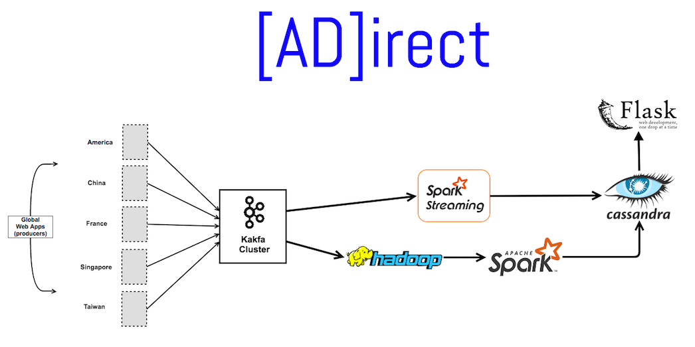

# directed-advertising

##### Table of Contents  
- [Goal](#goal)

- [Clusters](#clusters)  

- [Data Pipeline](#data-pipeline)

- [Tools and Frameworks](#frameworks-and-versions)

- [Spark](#spark)

---

###Goal
The goal of this project was to create a data pipeline for an e-commerce company
to target advertisements to their customers based on their search and purchase
history.  With 1,000,000 different products in 10 product categories, and 50,000
unique users, we'd like to target advertisements to users who continuously searched
in a particular category but did not yet make the purchase.  The products that we
decide to advertise to them will be based on their most recent searches within the
category, but can also be based on product popularity (calculated by number of
times the product was purchased).

###Clusters
The data pipeline consists of two 4-node clusters using AWS EC2 instances.
Each cluster had a master and 3 workers, for a total of 8 nodes.

The nodes were instance-type m4.large with 2 CPUs and 8GB Mem each (EBS magnetic
storage), all running Ubuntu 14.04.2 LTS (trusty).

###Data Pipeline

1)

2)

3)

###Tools and Frameworks
- Kafka: 0.10.1 (Scala 2.10)
- kafka-python: 1.3.2 (python 2.7)
- Hadoop 2.7.2

- Spark: 2.1.0
- Cassandra: 3.9
- Flask: 0.12

###Spark 
To run the spark programs, cd into the `spark` directory. There are two files: `batch_aDirect.py` and `stream_aDirect.py`.
You can omit the cassandra IPs if running in the same cluster.

batch:
`spark-submit --master <master_network_socket> --packages com.datastax.spark:spark-cassandra-connector_2.11:2.0.0-M3 --conf spark.cassandra.connection.host="<cassandra seed>" batch_aDirect.py`

streaming:
`spark-submit --master <master_network_socket> --packages org.apache.spark:spark-streaming-kafka-0-8-assembly_2.11:2.1.0,com.datastax.spark:spark-cassandra-connector_2.11:2.0.0-M3 stream_aDirect.py`
